# Linux Command and their uses
# ps
Your computer is running, at all times, tons of different processes. You can inspect them by the **ps** command;

this command also have others sub command in it
-**ps axww**

-**ps ax**

## top
The **top** command is used to display dynamic real-time information about running processes in the system, it really handy to understand what is going on.
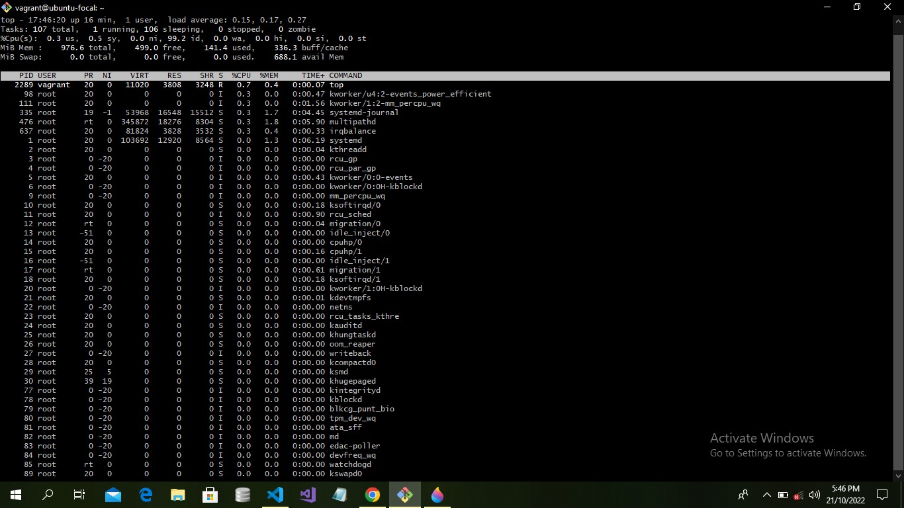
This processes is long-running. To quit, you can type the **q** letter or **ctrl-C**.

### df
The **df** command is used to get disk usage information. The basic form will print information about the volumes mounted.
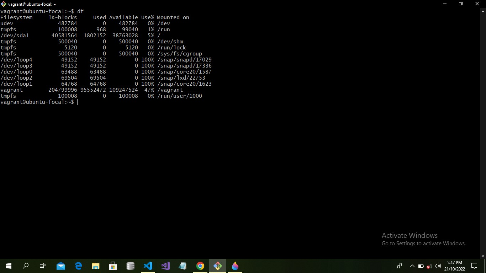
Using the **-h** option (**df -h**) will show those in a human readable format
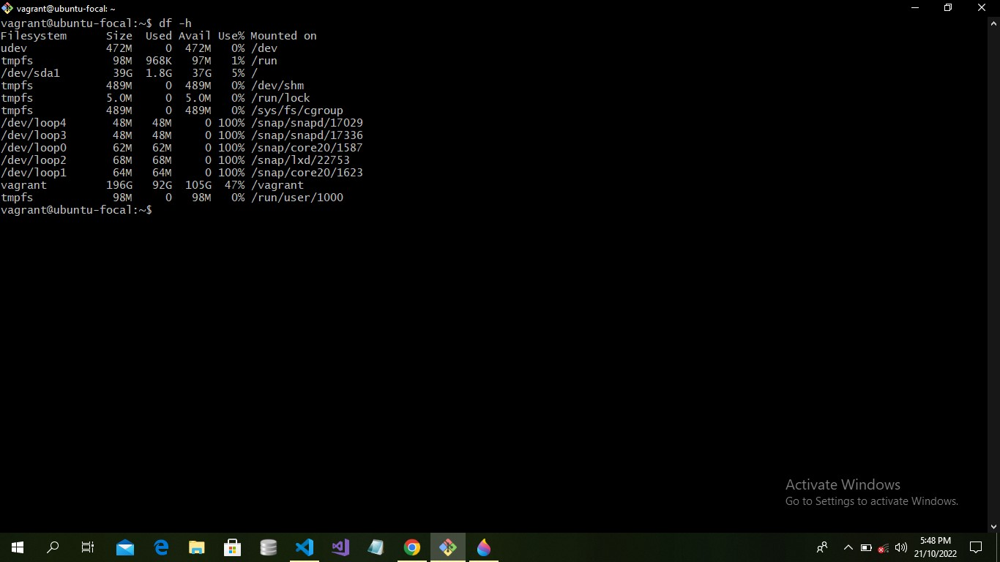
#### du
The **du** command will calculate the size of a directory as a whole
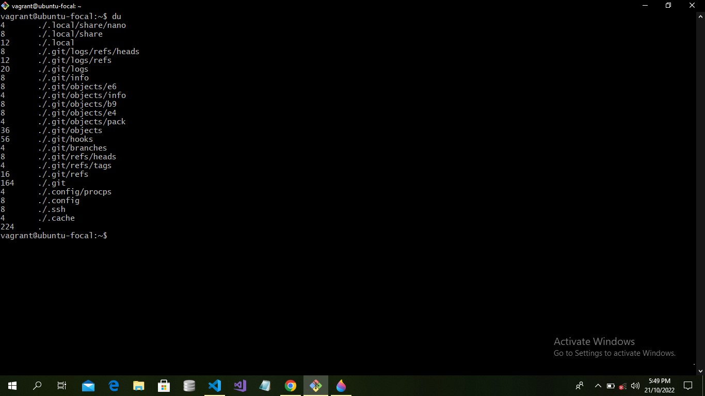
The **(du *)** will calculate the size of each file individually

##### echo 
The **echo** commmand does one simple job: it print s to the output the argument passed to it.
An example **(echo "hello world")**
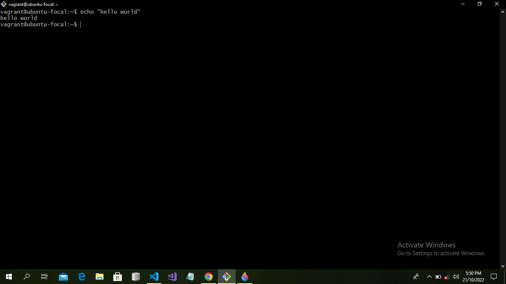
###### touch
You can create an empty file using the **touch** command
**touch filename**
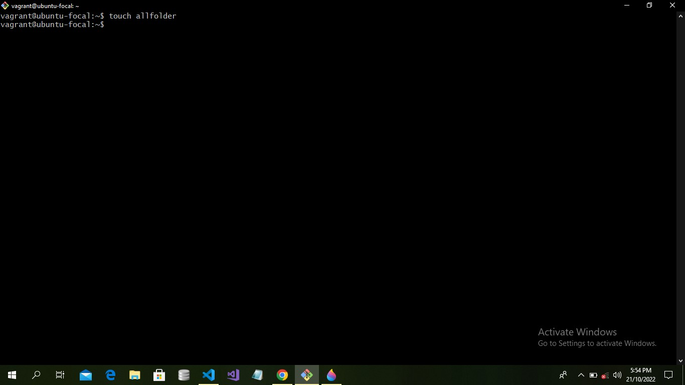
if the file already exits, it open the file in write mode, and the timestamp of the file is updated

# pwd
Whenever you feel lost in the filesystem, you call the **pwd** command to know where you are
it will print the current folder path
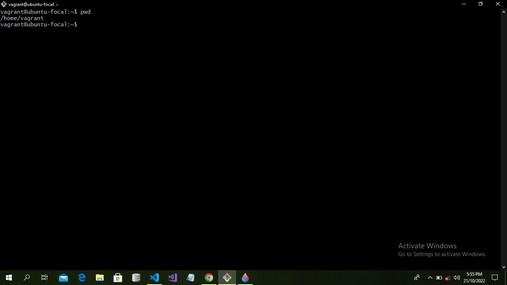

## ls 
Inside a folder you can list all the files that the folder cantains using the **ls** command 
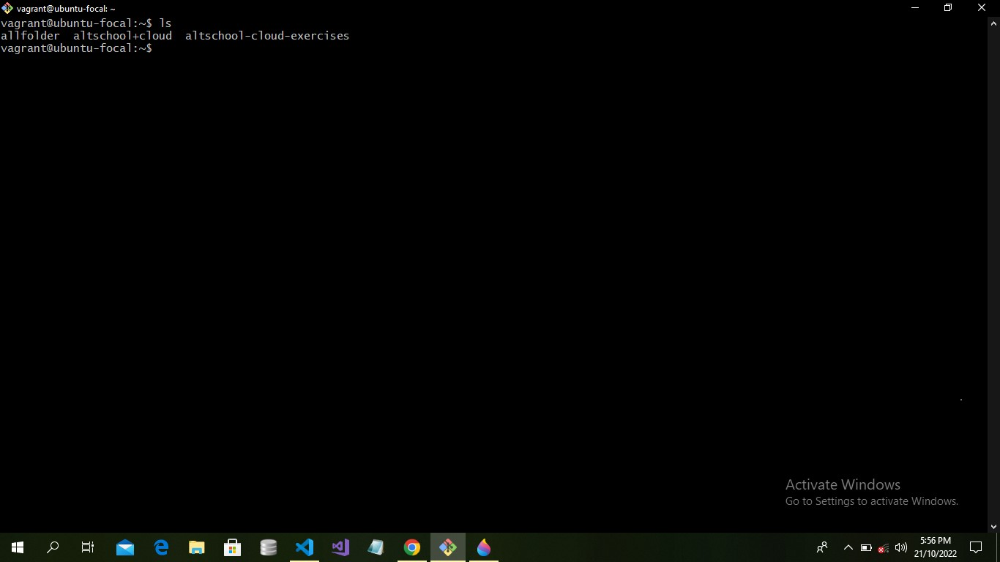
-If you add a folder name or path, it will print that folder contents eg. **ls /bin**
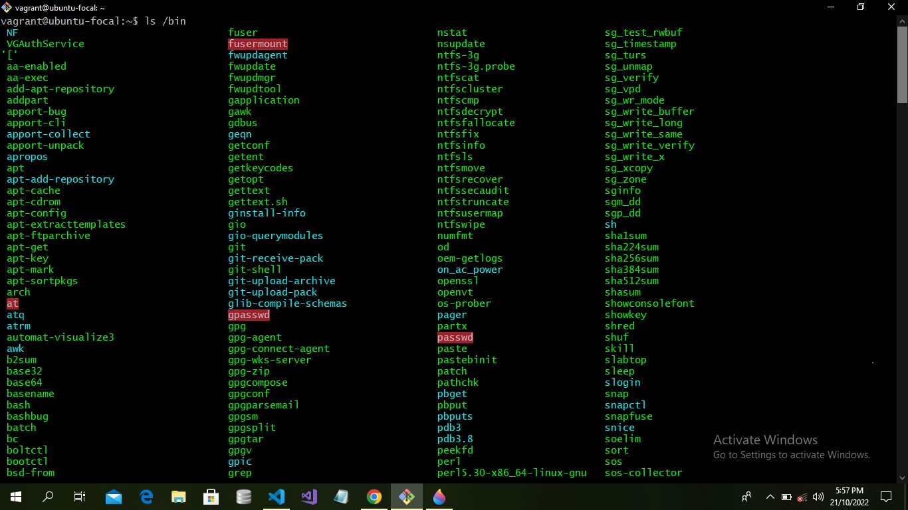
-You can also show all the list of files in a folder both hidden and unhiden files in a folder by using the **ls -al** command 
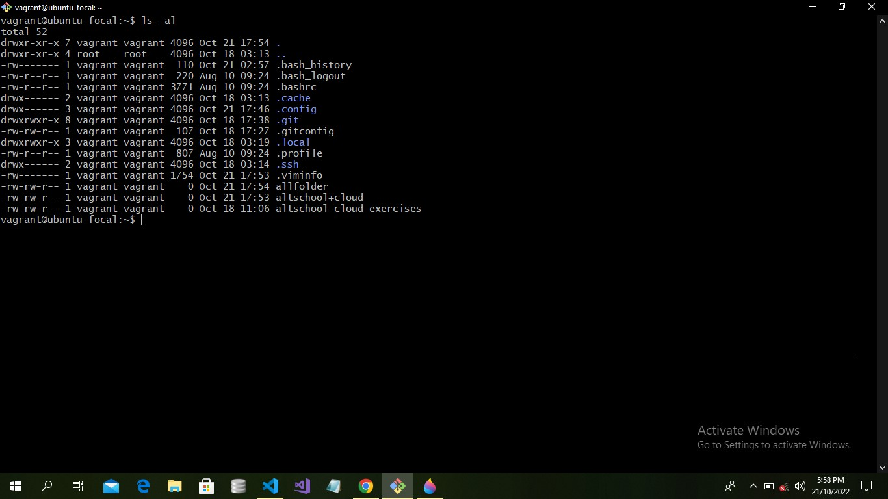
### man 
This command helps us to understand other command, each time we dont know how to used a command we type the **(man <command>)** to get the manual.
-This man (manual page) are essential tool to learn as a developer
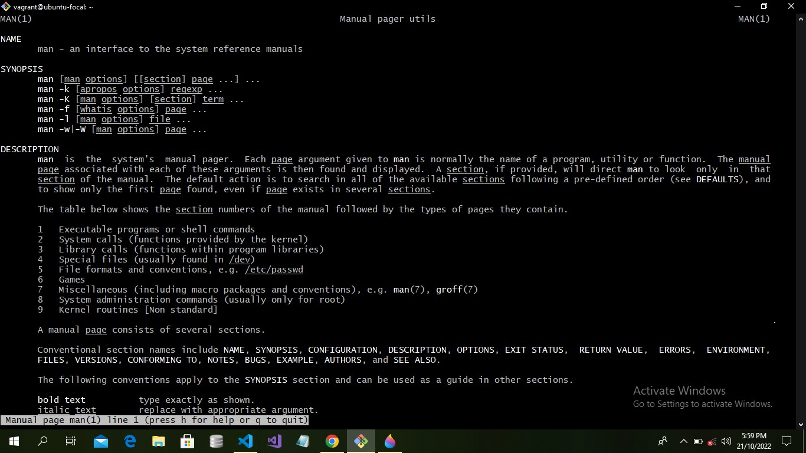
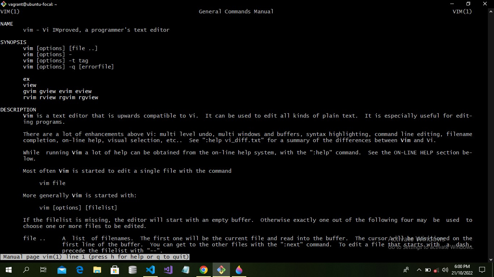
#### mkdir
You can create folder using the **mkdir** command
by using it as **mkdir<foldername>** and we also create multiple folder using **mkdir <foldername> <foldername>**
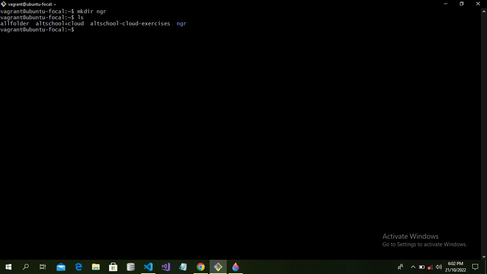
##### rmdir 
This works like the mkdir, but this delete folder using the **rmdir**
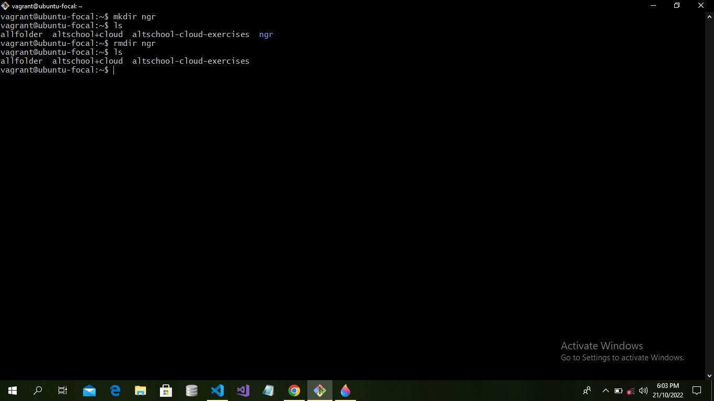
-To delete a folder with files in it we use the **rm -rf <foldername>**
